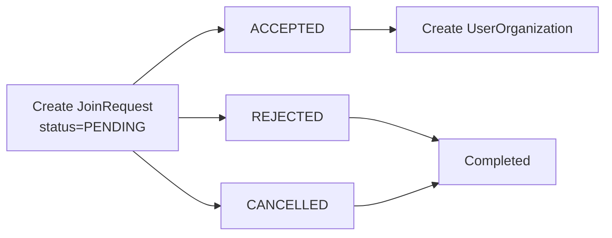

# 📩 JoinRequest

## Опис

**JoinRequest** — це сутність, яка представляє запит на створення членства між **User** та **Organization**.

JoinRequest використовується у двох сценаріях:

- користувач надсилає запит на вступ до організації (`FROM_USER`);
- організація надсилає користувачу запрошення (`FROM_ORGANIZATION`).

Сутність існує лише до моменту обробки запиту. Після прийняття (`ACCEPTED`) створюється запис у `UserOrganization`, який представляє фактичне членство користувача в організації.

---

## Представлення сутності

На даний момент JoinRequest має одне представлення.

| DTO         | Використовується                             |
| ----------- | -------------------------------------------- |
| JoinRequest | створення, перегляд та обробка Join Requests |

---

## Database Model

### ERD

<Diagram name="joinRequest" />


### JoinRequest

| Поле                   | Тип                                                                  | Обов'язкове | Опис                                      |
| ---------------------- | -------------------------------------------------------------------- | :---------: | ----------------------------------------- |
| id                     | string                                                               |      ✔      | UUID Join Request                         |
| senderId               | string \| null                                                       |             | FK → User (ініціатор-користувач)          |
| senderOrganizationId   | string \| null                                                       |             | FK → Organization (організація-ініціатор) |
| receiverOrganizationId | string \| null                                                       |             | FK → Organization (одержувач запиту)      |
| receiverUserId         | string \| null                                                       |             | FK → User (одержувач запрошення)          |
| direction              | [JoinRequestDirection](/constants/organization#joinrequestdirection) |      ✔      | Напрямок Join Request                     |
| status                 | [JoinRequestStatus](/constants/organization#joinrequeststatus)       |      ✔      | Поточний статус                           |
| createdAt              | DateTime                                                             |      ✔      | Дата створення                            |
| updatedAt              | DateTime                                                             |      ✔      | Дата останньої зміни                      |

---

## Response DTO

JoinRequest використовується у відповідях:

- POST /organization/join-request
- PATCH /organization/join-request/status
- GET /organization/:organizationId/join-requests
- GET /organization/join-request/:id

### JoinRequest

| Поле                   | Тип                                                                  | Опис                         |
| ---------------------- | -------------------------------------------------------------------- | ---------------------------- |
| id                     | string                                                               | ID Join Request              |
| senderId               | string \| null                                                       | ID користувача-ініціатора    |
| senderOrganizationId   | string \| null                                                       | ID організації-ініціатора    |
| receiverOrganizationId | string \| null                                                       | ID організації-одержувача    |
| receiverUserId         | string \| null                                                       | ID користувача-одержувача    |
| direction              | [JoinRequestDirection](/constants/organization#joinrequestdirection) | Напрямок Join Request        |
| status                 | [JoinRequestStatus](/constants/organization#joinrequeststatus)       | Поточний статус              |
| createdAt              | DateTime                                                             | Дата створення               |
| updatedAt              | DateTime                                                             | Дата останньої зміни         |
| sender                 | [UserPreview](#userpreview) \| null                                  | Дані користувача-відправника |
| senderOrganization     | [OrganizationPreview](#organizationpreview) \| null                  | Організація-відправник       |
| receiverOrganization   | [OrganizationPreview](#organizationpreview) \| null                  | Організація-одержувач        |
| receiverUser           | [UserPreview](#userpreview) \| null                                  | Користувач-одержувач         |


### UserPreview

| Поле    | Тип                                 | Опис                |
| ------- | ----------------------------------- | ------------------- |
| id      | string                              | ID користувача      |
| name    | string                              | Ім'я користувача    |
| email   | string                              | Email користувача   |
| profile | [UserProfile](user-profile) \| null | Профіль користувача |

### OrganizationPreview

| Поле        | Тип            | Опис                      |
| ----------- | -------------- | ------------------------- |
| id          | string         | ID організації            |
| name        | string         | Назва організації         |
| email       | string \| null | Email організації         |
| phoneNumber | string \| null | Контактний телефон        |
| description | string \| null | Короткий опис організації |
| avatar      | string \| null | URL аватарки              |

Приклад

```json
{
  "id": "2e0d3131-2ce3-4c50-80b9-c19bfcb20e9f",
  "senderId": "decdbe5a-98e2-443c-8f41-0b9656b314dd",
  "senderOrganizationId": null,
  "receiverOrganizationId": "314444ad-f624-40cd-b9db-63395219d5e2",
  "receiverUserId": null,
  "status": "PENDING",
  "direction": "FROM_USER",
  "createdAt": "2026-07-13T06:50:15.591Z",
  "updatedAt": "2026-07-13T06:50:15.591Z",
  "sender": {
    "name": "Alona Kuz"
  },
  "senderOrganization": null,
  "receiverOrganization": {
    "name": "Amazon"
  },
  "receiverUser": null
}
```

---

## JoinRequestDirection

| Значення          | Опис                                              |
| ----------------- | ------------------------------------------------- |
| FROM_USER         | Користувач надсилає запит на вступ до організації |
| FROM_ORGANIZATION | Організація надсилає користувачу запрошення       |

---

## JoinRequestStatus

| Значення  | Опис            |
| --------- | --------------- |
| PENDING   | Очікує обробки  |
| ACCEPTED  | Запит прийнято  |
| REJECTED  | Запит відхилено |
| CANCELLED | Запит скасовано |

---

## Життєвий цикл

JoinRequest створюється при ініціації вступу до організації або надсиланні запрошення.

Після обробки Join Request можливі два результати:

- при `ACCEPTED` створюється `UserOrganization`;
- при `REJECTED` або `CANCELLED` процес завершується без створення членства.



---

## Business Rules

### Загальні

- JoinRequest завжди створюється зі статусом `PENDING`;
- одночасно може існувати лише один активний (`PENDING`) Join Request з однаковими параметрами;
- після обробки Join Request повторно змінити його статус неможливо.

---

### FROM_USER

- користувач надсилає запит на вступ до організації;
- одержувачем є організація;
- обробити Join Request можуть лише `ADMIN` або `MODERATOR`;
- після прийняття створюється `UserOrganization`;
- користувачу надсилається Notification про результат.

---

### FROM_ORGANIZATION

- організація надсилає користувачу запрошення;
- одержувачем є користувач;
- прийняти або відхилити запрошення може лише запрошений користувач;
- після прийняття створюється `UserOrganization`;
- користувачу надсилається Notification про результат.

---

## Validation

| Поле                   | Правило                                   |
| ---------------------- | ----------------------------------------- |
| senderId               | UUID                                      |
| senderOrganizationId   | UUID                                      |
| receiverOrganizationId | UUID                                      |
| receiverUserId         | UUID                                      |
| direction              | FROM_USER або FROM_ORGANIZATION           |
| status                 | PENDING, ACCEPTED, REJECTED або CANCELLED |

---

## Використання в API

| Endpoint                                                                                    | Призначення                            |
| ------------------------------------------------------------------------------------------- | -------------------------------------- |
| POST [/organization/join-request](/endpoints/join-request/create-join-request)              | Створити Join Request                  |
| PATCH [/organization/join-request/status](/endpoints/join-request/update-request-status)    | Обробити Join Request                  |
| GET [/organization/:organizationId/join-requests](/endpoints/join-request/get-org-requests) | Отримати всі Join Requests організації |
| GET [/organization/join-request/:id](/endpoints/join-request/get-request-by-id)             | Отримати Join Request                  |

---

## Пов'язані сутності

- [User](user)
- Organization
- [UserOrganization](organization-member)
- Notification