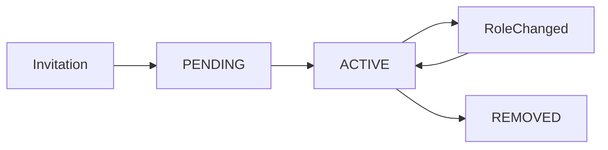

# 👥 UserOrganization

## Опис

**UserOrganization** — це зв’язкова сутність між **User** та **Organization**, яка представляє членство користувача в організації.

Сутність містить:

- інформацію про користувача та організацію;
- роль користувача в організації;
- поточний статус членства;
- дату створення членства.

Member не існує самостійно — він завжди належить одночасно одному користувачу та одній організації.

---

## Представлення сутності

На відміну від User, Member має лише одне представлення.

| DTO                | Використовується                                |
| ------------------ | ----------------------------------------------- |
| OrganizationMember | список учасників організації, внутрішні сервіси |

---

## Database Model

### ERD

<Diagram name="userOrganization" />

### UserOrganization

| Поле           | Тип              | Обов'язкове | Опис                     |
| -------------- | ---------------- | :---------: | ------------------------ |
| id             | string           |      ✔      | UUID запису членства     |
| userId         | string           |      ✔      | FK → User                |
| organizationId | string           |      ✔      | FK → Organization        |
| role           | OrganizationRole |      ✔      | Роль користувача         |
| status         | MembershipStatus |      ✔      | Поточний статус членства |
| createdAt      | DateTime         |      ✔      | Дата створення членства  |

### Унікальні обмеження

| Constraint               | Опис                                                       |
| ------------------------ | ---------------------------------------------------------- |
| (userId, organizationId) | Один користувач може бути членом організації лише один раз |

---

## Response DTO

Member використовується у відповіді:

- GET /organization/:id

### OrganizationMember

| Поле           | Тип                                                          | Опис               |
| -------------- | ------------------------------------------------------------ | ------------------ |
| id             | string                                                       | ID запису членства |
| role           | [OrganizationRole](/constants/organization#orgaizationrole)  | Роль користувача   |
| status         | [MembershipStatus](/constants/organization#membershipstatus) | Статус членства    |
| userId         | string                                                       | ID користувача     |
| organizationId | string                                                       | ID організації     |
| user           | UserPreview + UserProfile                                    | Дані користувача   |

### user

| Поле    | Тип                                  | Опис                |
| ------- | ------------------------------------ | ------------------- |
| id      | string                               | ID користувача      |
| name    | string                               | Ім'я                |
| profile | [UserProfile](user-profile)  \| null | Профіль користувача |

Приклад

```json
{
  "id": "60f5c5de-9a79-481c-89ef-eaa1d470da28",
  "role": "ADMIN",
  "status": "ACTIVE",
  "userId": "decdbe5a-98e2-443c-8f41-0b9656b314dd",
  "organizationId": "f2cf7455-a984-4e04-a837-7346a792fc7d",
  "user": {
    "id": "decdbe5a-98e2-443c-8f41-0b9656b314dd",
    "name": "Alona Kuz",
    "profile": null
  }
}
```

---

## OrganizationRole

| Значення  | Опис                                                    |
| --------- | ------------------------------------------------------- |
| ADMIN     | Повний контроль над організацією та її учасниками       |
| MODERATOR | Керує учасниками та може запрошувати нових користувачів |
| MEMBER    | Звичайний учасник організації                           |

---

## MembershipStatus

| Значення | Опис                                         |
| -------- | -------------------------------------------- |
| PENDING  | Очікує прийняття запрошення або join request |
| ACTIVE   | Активний учасник організації                 |
| INVITED  | Запрошення створено                          |
| REMOVED  | Користувача було видалено з організації      |

---

## Життєвий цикл



---

## Business Rules

### Загальні

- один користувач може бути членом багатьох організацій;
- одна організація може містити багато учасників;
- комбінація `(userId, organizationId)` є унікальною.

### Створення

Member створюється після успішного прийняття Join Request.

---

### Видалення

Видалення Member:

- видаляє запис UserOrganization;
- створює Notification типу `ORG_MEMBER_REMOVED`.

---

### Зміна ролі

Зміна ролі:

- дозволена лише ADMIN;
- нова роль може бути лише `MODERATOR` або `MEMBER`;
- створює Notification типу `ORG_ROLE_UPDATED`.

---

### Запрошення

Запрошення нового учасника:

- дозволене ADMIN та MODERATOR;
- MODERATOR не може запросити ADMIN;
- якщо користувач уже є членом організації — повертається помилка.

---

## Validation

| Поле           | Правило              |
| -------------- | -------------------- |
| userId         | UUID                 |
| organizationId | UUID                 |
| role           | MODERATOR або MEMBER |

---

## Використання в API

| Endpoint                         | Призначення               |
| -------------------------------- | ------------------------- |
| POST /organization/members       | Запросити нового учасника |
| DELETE /organization/members     | Видалити учасника         |
| PATCH /organization/members/role | Змінити роль              |
| GET /organization/:id            | Отримати список учасників |

---

## Пов'язані сутності

- [User](user)
- Organization
- [UserProfile](user-profile)
- JoinRequest
- Notification