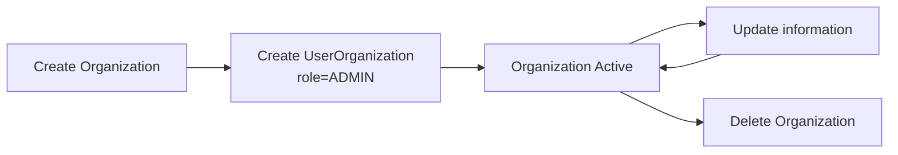

# 🏢 Organization

## Опис

**Organization** — це сутність, яка представляє організацію або спільноту, зареєстровану в системі.

Організація є одним із двох можливих типів хостів (поряд із User) та може:

- публікувати Tasks;
- приймати нових учасників;
- надсилати запрошення користувачам;
- отримувати Join Requests;
- залишати та отримувати Reviews;
- мати власне місцезнаходження;
- мати власний Host Profile.

Після створення організації користувач, який її створив, автоматично стає її адміністратором (`ADMIN`).

---

## Представлення сутності

Organization використовується у декількох представленнях залежно від endpoint.

| DTO                 | Використовується                     |
| ------------------- | ------------------------------------ |
| OrganizationPreview | результати пошуку організацій        |
| Organization        | створення та редагування організації |
| FullOrganization    | детальна інформація про організацію  |

---

## Database Model

### ERD

<Diagram name="organization" class="big-diagram" />

### Organization

| Поле             | Тип      | Обов'язкове | Опис                |
| ---------------- | -------- | :---------: | ------------------- |
| id               | string   |      ✔      | UUID організації    |
| name             | string   |      ✔      | Назва організації   |
| description      | string   |             | Короткий опис       |
| moreInfo         | string   |             | Детальна інформація |
| phoneNumber      | string   |             | Контактний телефон  |
| email            | string   |             | Email організації   |
| avatar           | string   |             | URL аватара         |
| stripeCustomerId | string   |             | Stripe Customer ID  |
| locationId       | number   |             | FK → Location       |
| createdAt        | DateTime |      ✔      | Дата створення      |

---

### Зв'язки

| Зв'язок              | Тип                                       | Опис                         |
| -------------------- | ----------------------------------------- | ---------------------------- |
| location             | [Location](location)                      | Місцезнаходження організації |
| members              | [UserOrganization](organization-member)[] | Учасники організації         |
| hostProfile          | Host                                      | Host-профіль організації     |
| joinRequestsSent     | [JoinRequest](join-request)[]             | Надіслані запрошення         |
| joinRequestsReceived | [JoinRequest](join-request)[]             | Отримані заявки на вступ     |
| reviews              | Review[]                                  | Отримані відгуки             |
| reviewsWrittenOrg    | Review[]                                  | Написані відгуки             |

---

## Response DTO

Organization використовується для передачі інформації про організацію між бекендом і клієнтом.

### OrganizationPreview

Використовується при пошуку організацій.

| Поле   | Тип            | Опис           |
| ------ | -------------- | -------------- |
| id     | string         | ID організації |
| name   | string         | Назва          |
| avatar | string \| null | Аватар         |

---

### Organization

Використовується після створення та редагування організації.

| Поле             | Тип                          | Опис                |
| ---------------- | ---------------------------- | ------------------- |
| id               | string                       | ID                  |
| name             | string                       | Назва               |
| description      | string \| null               | Опис                |
| moreInfo         | string \| null               | Детальна інформація |
| phoneNumber      | string \| null               | Телефон             |
| email            | string \| null               | Email               |
| avatar           | string \| null               | Аватар              |
| stripeCustomerId | string \| null               | Stripe Customer ID  |
| location         | [Location](location) \| null | Локація             |

---

### FullOrganization

Використовується при отриманні повної інформації про організацію.

Додатково містить:

- members;
- tasks;
- reviews;
- reviewsWrittenOrg;
- hostId;
- location.

---

## Життєвий цикл

---

## Business Rules

### Створення

Після створення організації:

- створюється запис Organization;
- створюється Location (якщо передано);
- створюється UserOrganization;
- користувачу автоматично призначається роль `ADMIN`.

---

### Редагування

Редагувати організацію може лише користувач із роллю `ADMIN`.

При оновленні:

- можуть змінюватися всі основні поля;
- Location оновлюється через `upsert`.

---

### Видалення

При видаленні організації також видаляються:

- Join Requests;
- UserOrganization;
- Host;
- Tasks;
- Reviews;
- Location.

Видалення виконується в одній транзакції.

---

## Validation

| Поле        | Правило                |
| ----------- | ---------------------- |
| name        | 2–50 символів          |
| avatar      | валідний URL           |
| email       | email                  |
| description | максимум 1000 символів |
| moreInfo    | максимум 2000 символів |
| phoneNumber | 5–30 символів          |

---

## API Endpoint'и

| Endpoint                                                                 | Призначення                 |
| ------------------------------------------------------------------------ | --------------------------- |
| GET [/organization](/endpoints/organization/get-organizations)           | Пошук організацій за назвою |
| POST [/organization/create](/endpoints/organization/create-organization) | Створити організацію        |
| GET [/organization/:id](/endpoints/organization/get-organization)        | Отримати організацію        |
| PATCH [/organization/:id](/endpoints/organization/update-organization)   | Оновити організацію         |
| DELETE [/organization/:id](/endpoints/organization/delete-organization)  | Видалити організацію        |

---

## Пов'язані сутності

- [User](user)
- [UserOrganization](organiation-member)
- [JoinRequest](join-request)
- Host
- [Location](location)
- Review
- [Task](task)