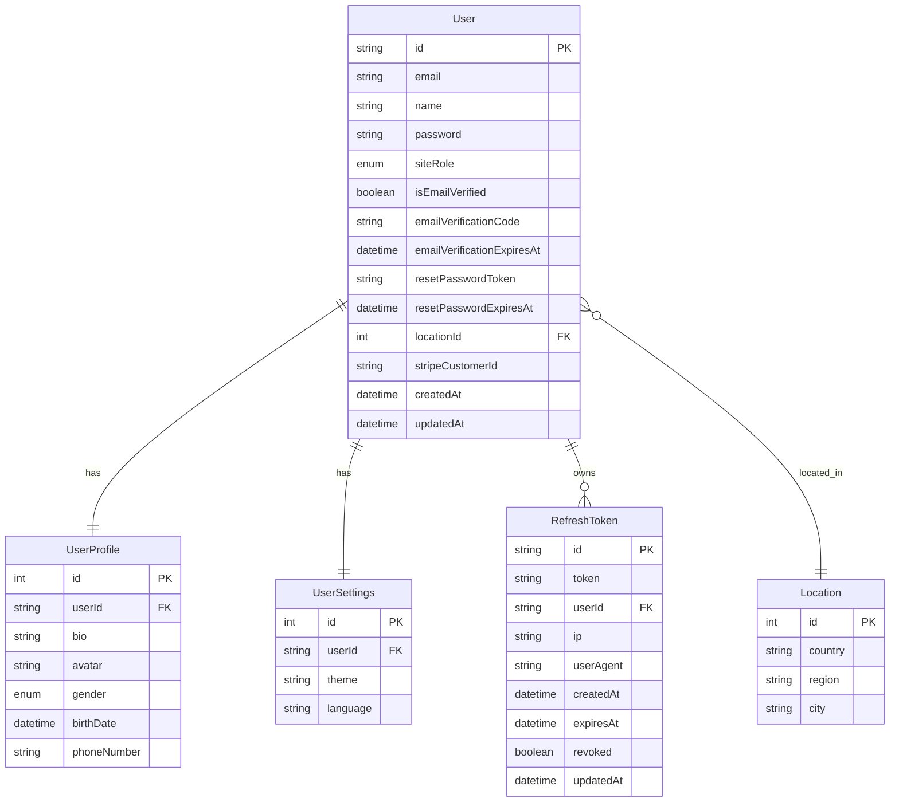

# 👤 User

## Опис

Сутність користувача системи.

## Включає:

- облікові дані (email, password)
- статус верифікації email
- профіль користувача (UserProfile)
- налаштування (UserSettings)
- refresh tokens
- зв’язки з tasks, organizations, reviews, chats тощо

## Представлення сутності

В системі User розділено на декілька DTO:

| DTO         | Призначення                       |
| ----------- | --------------------------------- |
| Auth DTO    | логін / реєстрація                |
| FullUser    | внутрішні сервіси та current-user |
| PublicUser  | публічна сторінка профіля         |
| UserPreview | коротке представлення користувача |

## 1. Auth Request DTO
### 🔐 Sign Up
| Поле     | Тип    | Обов'язкове | Опис                        |
| -------- | ------ | :---------: | --------------------------- |
| name     | string |     так     | Ім’я (3–30 символів)        |
| email    | string |     так     | Валідний email              |
| password | string |     так     | Пароль (мінімум 6 символів) |

### 🔑 Login
| Поле     | Тип    | Обов'язкове | Опис           |
| -------- | ------ | :---------: | -------------- |
| email    | string |     так     | Валідний email |
| password | string |     так     | Пароль         |

### 🔁 Forgot Password
| Поле  | Тип    | Обов'язкове | Опис              |
| ----- | ------ | :---------: | ----------------- |
| email | string |     так     | Email користувача |

### 🔄 Reset Password
| Поле     | Тип    | Обов'язкове | Опис                              |
| -------- | ------ | :---------: | --------------------------------- |
| password | string |     так     | Новий пароль (мінімум 6 символів) |


## 2. User DB Model
ERD


[Докладніше про зв'язки моделей користувача в БД](/models/user)

### User
| Поле                       | Тип                                  | Обов'язкове | Опис                   |
| -------------------------- | ------------------------------------ | :---------: | ---------------------- |
| id                         | string                               |     так     | UUID                   |
| email                      | string                               |     так     | Унікальний email       |
| name                       | string                               |     так     | Ім’я                   |
| password                   | string                               |     так     | Хешований пароль       |
| siteRole                   | [SiteRole](/constants/user#siterole) |     так     | USER / ADMIN           |
| isEmailVerified            | boolean                              |     так     | Чи підтверджений email |
| emailVerificationCode      | string                               |     ні      | Код підтвердження      |
| emailVerificationExpiresAt | DateTime                             |     ні      | Термін дії коду        |
| resetPasswordToken         | string                               |     ні      | Токен скидання пароля  |
| resetPasswordExpiresAt     | DateTime                             |     ні      | Термін дії reset token |
| locationId                 | number                               |     ні      | FK → Location          |
| stripeCustomerId           | string                               |     ні      | Stripe customer ID     |
| createdAt                  | DateTime                             |     так     | Дата створення         |
| updatedAt                  | DateTime                             |     так     | Дата оновлення         |

<!-- 
### UserProfile
| Поле        | Тип                 | Обов'язкове | Опис            |
| ----------- | ------------------- | :---------: | --------------- |
| id          | number              |     так     | ID              |
| userId      | string              |     так     | FK → User       |
| bio         | string   \|    null |     ні      | Біографія       |
| avatar      | string   \|    null |     ні      | URL аватарки    |
| gender      | Gender   \|    null |     ні      | Стать           |
| birthDate   | DateTime \|    null |     ні      | Дата народження |
| phoneNumber | string   \|    null |     ні      | Телефон         |


### UserSettings
| Поле     | Тип    | Обов'язкове | Опис          |
| -------- | ------ | :---------: | ------------- |
| id       | number |     так     | ID            |
| userId   | string |     так     | FK → User     |
| theme    | string |     так     | light / dark  |
| language | string |     так     | en / de / ... |


### RefreshToken
| Поле      | Тип                 | Обов'язкове | Опис           |
| --------- | ------------------- | :---------: | -------------- |
| id        | string              |     так     | UUID           |
| token     | string              |     так     | Refresh token  |
| userId    | string              |     так     | FK → User      |
| ip        | string   \|    null |     ні      | IP адреса      |
| userAgent | string   \|    null |     ні      | User agent     |
| createdAt | DateTime            |     так     | Дата створення |
| expiresAt | DateTime            |     так     | Термін дії     |
| revoked   | boolean             |     так     | Чи відкликаний |
| updatedAt | DateTime            |     так     | Дата оновлення |
-->

## 3. Auth/User Response DTO
### 🔹 Auth Response

👉 використовується:
-  `/auth/login`

```json
{
  "message": "User logged in successfully",
  "code": "USER_LOGGED_IN",
  "user": {
    "id": "uuid",
    "name": "User Example",
    "email": "user@email.com",
    "avatar": null,
    "siteRole": "USER",
    "settings": {
      "theme": "dark",
      "language": "en"
    },
    "profile": null
  }
}
```

### 🔹 FullUser

👉 використовується:
- `/auth/current-user`
- внутрішні сервіси
- редагування профіля

**Поля**
| Поле             | Тип                                                | Опис                  |
| ---------------- | -------------------------------------------------- | --------------------- |
| id               | string                                             | ID                    |
| email            | string                                             | Email                 |
| name             | string                                             | Ім’я                  |
| siteRole         | [SiteRole](/constants/user#siterole)               | Роль                  |
| isEmailVerified  | boolean                                            | Статус email          |
| stripeCustomerId | string             \| null                         | Stripe customer       |
| profile          | [UserProfile](user-profile)                \| null | Профіль               |
| location         | Location                   \| null                 | Локація               |
| userSettings     | [UserSettings](user-settings)                      | Налаштування          |
| organizations    | UserOrganization[]                                 | Організації           |
| tasks            | Task[]                                             | Hosted + joined tasks |
| createdAt        | DateTime                                           | Дата створення        |
| updatedAt        | DateTime                                           | Дата оновлення        |

Приклад
```json
{
  "id": "uuid",
  "email": "user@email.com",
  "name": "User Example",
  "siteRole": "USER",
  "isEmailVerified": true,
  "stripeCustomerId": null,

  "profile": {
    "bio": "About me",
    "avatar": "https://example.com/avatar.jpg"
  },

  "location": {
    "id": 1,
    "country": "Germany",
    "region": "Bavaria",
    "city": "Munich"
  },

  "userSettings": {
    "id": 1,
    "theme": "dark",
    "language": "en"
  },

  "organizations": [],

  "tasks": []
}
```

### 🔹PublicUser

👉 використовується:
- `GET /user/profile/public/:id`

**Особливості**

PublicUser:

- не містить sensitive fields
- не містить refreshTokens
- не містить settings
- не містить email

Поля
| Поле            | Тип                                        | Опис                  |
| --------------- | ------------------------------------------ | --------------------- |
| id              | string                                     | ID                    |
| name            | string                                     | Ім’я                  |
| createdAt       | DateTime                                   | Дата створення        |
| profile         | [UserProfile](user-profile)        \| null | Профіль               |
| location        | Location           \| null                 | Локація               |
| organizations   | UserOrganization[]                         | Організації           |
| reviewsReceived | Review[]                                   | Отримані reviews      |
| tasks           | Task[]                                     | Hosted + joined tasks |


Приклад
```json
{
  "status": "success",
  "code": "USER_PROFILE_RETRIEVED",
  "data": {
    "user": {
      "id": "4e53467",
      "name": "User Example",

      "createdAt": "2026-03-16T20:45:46.422Z",

      "profile": {
        "bio": "About me",
        "avatar": "https://example.com/avatar.jpg"
      },

      "location": null,

      "organizations": [],

      "reviewsReceived": [],

      "tasks": []
    }
  }
}
```

### 🔹 UserPreview

👉 використовується:

- joinedUsers
- participants
- host.user
- search users

Поля
| Поле   | Тип            | Опис       |
| ------ | -------------- | ---------- |
| id     | string         | ID         |
| name   | string         | Ім’я       |
| avatar | string \| null | Avatar URL |

Приклад

```json
{
  "id": "decdbe5a-914dd",
  "name": "User Name",
  "avatar": "https://example.com/avatar.jpg"
}
```

## ⚠️ Важливі правила
🔐 Безпека

Ніколи не повертаються:

- password
- emailVerificationCode
- emailVerificationExpiresAt
- resetPasswordToken
- resetPasswordExpiresAt
- refreshTokens

Sensitive fields видаляються через:
```ts
sanitizeUser()
```

## 🔁 Refresh Token Flow
- access token → короткоживучий
- refresh token → довгоживучий
- refresh token зберігається в БД
- logout → refresh tokens видаляються

## 🔥 Валідація
| Поле     | Правило            |
| -------- | ------------------ |
| email    | Валідний email     |
| password | Мінімум 6 символів |
| name     | 3–30 символів      |

## Архітектурний момент
| DTO         | Де використовується             |
| ----------- | ------------------------------- |
| FullUser    | current-user, внутрішні сервіси |
| PublicUser  | публічний профіль               |
| UserPreview | списки / host / participants    |

## Пов’язані сутності
- [UserProfile](user-profile)
- [UserSettings](user-settings)
- [RefreshToken](refresh-token)
- Location
- Organization
- [Task](task)
- Review