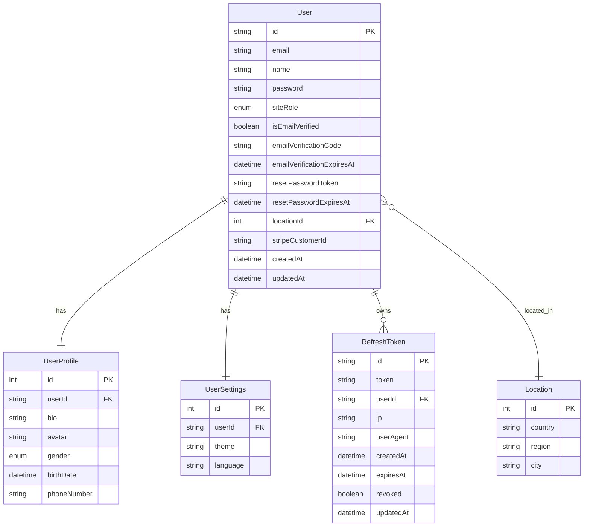

# User Models

## ERD

```mermaid
erDiagram
    User ||--|| UserProfile : has
    User ||--|| UserSettings : has
    User ||--o{ RefreshToken : owns
    User }o--|| Location : located_in

    User {
        string id PK
        string email
        string name
        string password
        enum siteRole
        boolean isEmailVerified
        string emailVerificationCode
        datetime emailVerificationExpiresAt
        string resetPasswordToken
        datetime resetPasswordExpiresAt
        int locationId FK
        string stripeCustomerId
        datetime createdAt
        datetime updatedAt
    }

    UserProfile {
        int id PK
        string userId FK
        string bio
        string avatar
        enum gender
        datetime birthDate
        string phoneNumber
    }

    UserSettings {
        int id PK
        string userId FK
        string theme
        string language
    }

    RefreshToken {
        string id PK
        string token
        string userId FK
        string ip
        string userAgent
        datetime createdAt
        datetime expiresAt
        boolean revoked
        datetime updatedAt
    }

    Location {
        int id PK
        string country
        string region
        string city
    }
```

## User DB Model

## UserProfile DB Model

## UserSettings DB Model

## RefreshToken DB Model

## Location DB Model

